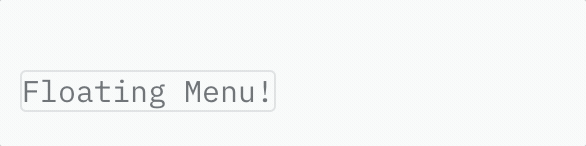
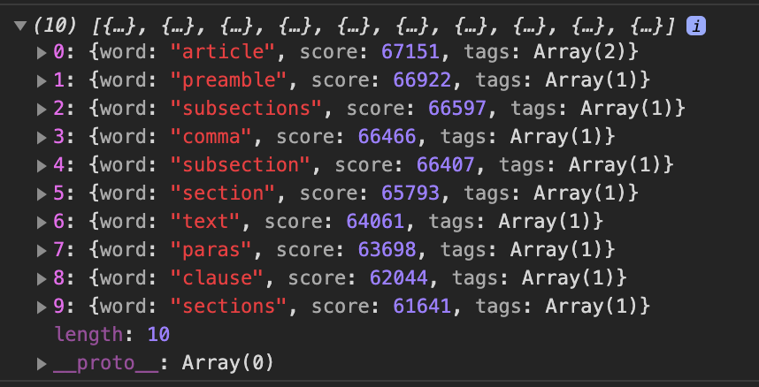
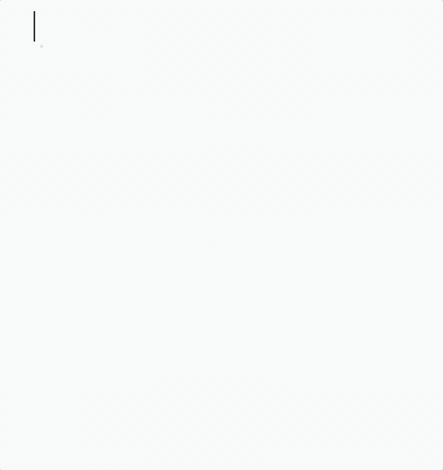
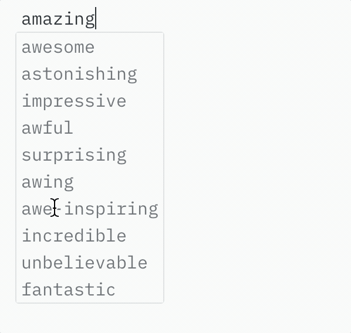

What's the best way of getting user input into your application? This isn't an easy question. Maybe we should try to answer this by looking at the type of input you want to get? Often, it is well-structured and relatively static. In these cases forms are ideal as they let you specifically state what you need from the user and then save it in a server-friendly format. Other times, however, this input is much more dynamic. A simple case of this are blog comments: where `<textarea />` leaves a lot to be desired from a UX point of view. You could always set the component to `contentEditable="true"` but I could write a whole essay on why contentEditable is broken (I just might one day...). After extensive testing though I can confirm that it's the best way to go for dynamic, rich user input. Dealing with `contentEditable` directly though is... horrible. Luckily, there are frameworks out there that take much of the hassle out of using contentEditable whilst keeping the things that make it good. The current best of these (IMHO) is Slate.js:

> Slate is a completely customizable framework for building rich text editors.
>
> Slate lets you build rich, intuitive editors like those in Medium, Dropbox Paper or Google Docs—which are becoming table stakes for applications on the web—without your codebase getting mired in complexity.

The pros of using Slate over, say, Draft.js or ProseMirror are many:

- **It's built in React:** so no need to use a completely different view layer to the rest of your site or worry about stale state in components (that isn't *your* fault at least 😉).
- **There's no hardcoded schema:** at Tr33llion, we are using an n-ary tree structure for our documents. Slate accepts deeply nested structures without complaint and allows you to specify how they are rendered.
- **It mirrors the DOM:** Slate.js saves nodes as a nested structure, which means they are familiar to deal with and style.

Slate.js has a comprehensive walkthrough for getting up and running. However, once you've completed that, you're pretty much on your own. This tutorial aims to pick up where the walkthrough leaves off. Here, we'll be:

- Building a simple editor that saves the current word to state and then runs a thesaurus request on that word.
- Take the first 10 words returned and display them in a drop down modal window that follows the cursor.
- Allow the user to change the current word for one in the list either with the mouse or keyboard.

We'll do it all in Typescript to take advantage of Slate.js' excellent type definitions. On top of that, there isn't any typescript documentation for Slate as it stands, so this can also act as a primer if you want to use Slate with TS in your future projects.

I like this tutorial project because it should give you the necessary skills to build upon it to create something pretty cool!

Before we begin, this tutorial expects that you have a basic knowledge of React, ES6 and Typescript syntax (we keep the TS pretty simple here though, as it's more for the developer experience). I would also expect that you've run through the Slate.js walkthrough as it gives a good overview of styling nodes and applying custom formatting — which we do not touch on here.

### A quick note on Slate.js beta and breaking changes
Slate is still in beta and has undergone a number of **breaking** changes over the past few months. This has stabilised somewhat since the start of 2020, but it is not possible to guarantee that this will remain the case forever until version 1.0.0. This tutorial uses Slate 0.57.1, I recommend that this is the version that you use when following along. Updates to the tutorial will be reflected here.

## 01: Initial set up

We'll be using the excellent Create-React-App for initialising this project. To get started, use the following command in whatever directory you want to initialise the project in:

```bash
npx create-react-app slate-thesaurus-editor --template typescript
```

First, delete the logo and `app.css` files, as well as our test files as we won't be writing tests in this tutorial. Also, update `app.tsx` to a display a basic `Hello World` page:

```tsx
import React from "react";

const App = () => {
  return <div>Hello World!</div>;
};

export default App;
```

Test this is running correctly in development mode with `npm run start`.

## 02: Setting up Slate.js

Assuming everything is going fine so far. We next need to install Slate and the slate-react wrapper library:

```bash
npm i slate slate-react
```

As the walkthrough goes over setting things up, I won't duplicate things here. Let's set up the basic editor components in App like so:

```tsx
import React, { useMemo, useState } from "react";
import { createEditor, Node } from "slate";
import { Slate, Editable, withReact } from "slate-react";

const App: React.FC = () => {
  const editor = useMemo(() => withReact(createEditor()), []);
  const [value, setValue] = useState<Node[]>([
    {
      type: "paragraph",
      children: [{ text: "A line of text in a paragraph." }]
    }
  ]);

  return (
    <Slate 
      editor={editor} 
      value={value} 
      onChange={value => setValue(value)}
    >
      <Editable />
    </Slate>
  );
};

export default App;
```

Note that the Editor itself is made of two components: `Slate` and `Editable`. So far, we haven't done anything differently to the walkthrough. That's about to change though. First though, we should add some basic styles to the editor.

## 03: Basic app styles

Let's add some global css to make things a little easier and more pleasant to work with. In `index.css` add the following lines:

```css{1-5}
:root {
  font-size: 62.5%; /* sets 1rem === 10px */
  background-color: #F8FAF9;
  color: #262D33;
}

body {
  margin: 0;
  font-family: -apple-system, BlinkMacSystemFont, 'Segoe UI', 'Roboto', 'Oxygen',
    'Ubuntu', 'Cantarell', 'Fira Sans', 'Droid Sans', 'Helvetica Neue',
    sans-serif;
  -webkit-font-smoothing: antialiased;
  -moz-osx-font-smoothing: grayscale;
}
```

As mentioned in the comment, setting the global font-size to 62.5% makes `1rem === 10px` and allows us to do all of our sizing with relative units where appropriate without the need to reach for a calculator each time. Since learning this trick, I've never gone back.

Next, let's add some styles to the editor itself. We'll be using Styled Components for this so let's add it to our application:

```bash
npm i styled-components
```

I find a good practice for component organisation is to place the styles with the .tsx code in a folder named after the component itself. That way you can reference the folder when importing. Rename the `App.tsx` file to `index.tsx` and place it in a folder called `App` in your `src` directory. Make a new file called `styles.tsx` in the `App` directory too. Your folder structure should look like this:

```text
/src
 |- /App
 |   |- index.tsx
 |   |- styles.tsx
... 
```

In `styles.tsx` lets create 2 new styled components, `EditorStyles` and `Container`. I want the editor to remain centred and have a width between 60 and 80 chars for readability. If this was a production app, we could spend a lot more time on this but, for simplicity's sake, here are the styles:

```tsx
import styled from "styled-components";

export const Container = styled.div`
  margin: 2rem auto;
  max-width: 72rem; //80chars
  min-width: 54rem; //60chars
  display: flex;
  flex-direction: column;
`;

export const EditorStyles = styled.div`
  padding: 0 0 45vh 0;
  font-family: "IBM Plex Mono", monospace;
  font-size: 1.5rem;
`;
```

[IBM Plex Mono](https://www.ibm.com/plex/) is a lovely monospaced font by the [Bold Monday](https://www.boldmonday.com/) foundry which is freely available from the Google Fonts api. To use it just add this line to the `<head>` tag of `public/index.html`:

```html
<link href="https://fonts.googleapis.com/css?family=IBM+Plex+Mono&display=swap" rel="stylesheet">
```

Next, import and use the styled components in your app component:

```tsx
import React, { useMemo, useState } from "react";
import { createEditor, Node } from "slate";
import { Slate, Editable, withReact } from "slate-react";

import { Container, EditorStyles } from "./styles"; // highlight-line

export const App: React.FC = () => { // highlight-line
  const editor = useMemo(() => withReact(createEditor()), []);
  const [value, setValue] = useState<Node[]>([
    {
      type: "paragraph",
      children: [{ text: "A line of text in a paragraph." }]
    }
  ]);

  return (
  // highlight-start
    <Container> 
      <EditorStyles> 
  // highlight-end
        <Slate
          editor={editor}
          value={value}
          onChange={value => setValue(value)}
        >
          <Editable />
        </Slate> 
  // highlight-start
      </EditorStyles> 
    </Container>
  // highlight-end
  );
};
```

Note I've also changed `export default` to a named export to keep with Typescript best practices. Make sure you update your import statement to reflect the export change in your main `index.tsx` file too:

```tsx
import React from "react";
import ReactDOM from "react-dom";
import "./index.css";
import { App } from "./App"; //highlight-line
import * as serviceWorker from "./serviceWorker";

ReactDOM.render(<App />, document.getElementById("root"));

// hide-start
// If you want your app to work offline and load faster, you can change
// unregister() to register() below. Note this comes with some pitfalls.
// Learn more about service workers: https://bit.ly/CRA-PWA
serviceWorker.unregister();
// hide-end
```

That should be enough for editor styling. Let's move on to actually writing some code...

##  04: Saving the cursor position to state

In order to be able to display a floating menu at the location of the cursor. Our application needs to know the cursor's position in the window. The best way I have found of doing this is outside of Slate and via the DOM through React's `useEffect` hook. We can use the `javascript§Range.getBoundingClientRect()` method to get our current selection coordinates:

```tsx
export const App: React.FC = () => {

  /* ... */
  
  const [cursorPosition, setCursorPosition] = useState<DOMRect | null>(null);

  useEffect(() => {
    const sel = window.getSelection();
    if (!sel || sel.rangeCount === 0) return;
    setCursorPosition(sel.getRangeAt(0).getBoundingClientRect());
  }, [value]);

  // sanity check:
  console.log(cursorPosition);

  return (
  
    /* ... */
  
  );
};
```

Run the app. You should see a `DOMRect` object in the console whenever you type and change Slate's `value` prop.

```html
console output --> DOMRect {x: 708, y: 20, width: 0, height: 19, top: 20, …}
```

Let's put this to use!

## 05: Displaying the floating menu

Now that we have our cursor position. We can use it to display a floating menu that hovers below the cursor as you type. Let's start by creating a new folder to hold our Floating menu components. Create `/FloatingMenu` with a blank `index.tsx` and `styles.tsx` inside it. We'll want to send our cursor position to the FloatingMenu component as a prop so let's define an interface so Typescript knows about it in the new index.tsx:

```tsx
export interface IFloatingMenu {
  cursorPosition: DOMRect;
}
```

In essence, the FloatingMenu is a modal window as by definition, it floats over the editor window. It would make sense to render this outside of the normal DOM hierarchy for accessibility best practices. You can achieve this easily with `ReactDOM.createPortal` and is what we do here. For now, let's create a basic modal component to test our positioning:

```tsx
// highlight-start
import React from "react";
import ReactDOM from "react-dom";

import { StyledFloatingMenu } from "./styles";
// highlight-end

export interface IFloatingMenu {
  cursorPosition: DOMRect;
}

// highlight-start
export const FloatingMenu: React.FC<IFloatingMenu> = ({ cursorPosition }) => {
  return ReactDOM.createPortal(
    <StyledFloatingMenu position={cursorPosition}>
      Floating Menu!
    </StyledFloatingMenu>,
    document.body
  );
};
// highlight-end
```

Next, let's write the styles and make use of the `cursorPosition` prop. Create a `StyledFloatingMenu` component in `styles.tsx` as follows:

```tsx
import styled from "styled-components";
import { IFloatingMenu } from "./index";

export const StyledFloatingMenu = styled.div<IFloatingMenu>`
  display: flex; // for future item styling
  flex-direction: column; // for future item styling
  padding: 0;
  position: absolute;
  top: ${({ position }) =>
    position ? position.bottom + window.pageYOffset + 4 : -10000}px;
  left: ${({ position }) =>
    position ? position.left + window.pageXOffset - 5 : -10000}px;
  z-index: 100;
  margin-top: -0.2rem;
  opacity: 0.93;
  font-family: "IBM Plex Mono", monospace;
  font-size: 1.5rem;
  background-color: #f8faf9;
  color: #585f65;
  border: 1px solid #dadddf;
  border-radius: 3px;
`;

```

The important things to note here are the `top:` and `left:` properties. Let's break those down.

 ```tsx
 top: ${({ position }) =>
    position ? position.bottom + window.pageYOffset + 4 : -10000}px;
 ```

 `${({ position }) => ...` is how to access props from inside a styled component's style definition. We first check that the prop exists. If it does, then we actually want the menu to float below the cursor, hence the rather confusing `position.bottom` in the `top` definition. `window.pageYOffset`takes into account any window scrolling so that the calculated position is based on the viewport rather than the window as a whole. The integer value is just to offset the text so that it appears directly below the typed text. If there is no prop then we display this well offscreen. In fact, we will be conditionally rendering the component in React so this is an extra fallback that should never be used.

 The `left:` definition is identical to the above and the remainder of the styles are aesthetic only.

All that's left is to import and conditionally render your component into `App/index.tsx`:

```tsx
/* ... */

import { FloatingMenu } from "../FloatingMenu"; //highlight-line

export const App: React.FC = () => {
 
  /* ... */
 
  return (
    <>
      <Container>
        <EditorStyles>
          <Slate
            editor={editor}
            value={value}
            onChange={value => setValue(value)}
          >
            <Editable />
          </Slate>
        </EditorStyles>
      </Container>
      {cursorPosition && <FloatingMenu cursorPosition={cursorPosition} />} //highlight-line
    </>
  );
};
```

If you run the app now you should see this:



## 06: Pulling the current word from Slate

The second stage of this project involves getting the current word at the selection from the Slate editor. There are a lot of ways to do this, but I have found that the most robust way is to pull the word from the slate `value` itself. Looking at the Slate documentation, you can see that every time a change occurs in the editor, the onChange function gets called. Let's handle this ourselves.

Refactor the current onChange so that you can handle it outside of the render return in `App/index.tsx`:

```tsx
export const App: React.FC = () => {
  
  const [currentWord, setCurrentWord] = useState("");

  /* ... */

  const handleChange = (value: Node[]):void => {
    setValue(value);
  }; 
  
  /* ... */
  
  <Slate
    editor={editor}
    value={value}
    onChange={value => handleChange(value)}
  >
  
  /* ... */

}
```

We always want to keep the `setValue(value)` line as this is how Slate-react updates internally on user input. Next, Import `Editor` and `Range` from Slate. These are interfaces through which we can make changes and get data to and from the editor. They're also written in typescript which means that you can get a lot of information from the type def files about how they work (which is useful seeing as Slate's current documentation is somewhat lacking!). Just add them to your slate imports like so:

```tsx
import { createEditor, Node, Editor, Range } from "slate";
```

Now let's finish our `handleChange` function, we'll deconstruct the code afterwards:

```tsx
const handleChange = (value: Node[]):void => {
  setValue(value);
  
  if (!editor.selection) return;
  
  const [node] = Editor.node(editor, editor.selection);
  if (!node.text) return;
  
  const textToSelection = node.text.slice(
    0,
    Range.start(editor.selection).offset,
  );
  const allWords = node.text.split(/\W/);
  const wordsToSelection = textToSelection.split(/\W/);
  const currentIndex = wordsToSelection.length - 1;
  
  setCurrentWord(allWords[currentIndex]);
}; 
```

What's happening here? Let's take a look.

`Editor.node()` returns the Slate node as an array of `[node, path]` when passed the current editor and a Slate Range (in this case the selection). We currently don't care about the path, so we destructure the array to just the first element.

Because we have no idea where the current selection is in the node itself (the end user may have clicked halfway through a word for all we know) we want to use the current selection offset to work out where we are. But, we want to return the *whole* current word, not just up to the selection.

`textToSelection` slices the current node's text up to the offset of the selection start. We get this with `Range.start`: a utility function that returns the 'start' point of a selection's `anchor` and `focus` in order to always return the 'first' point in a selection.

Next we get `allWords`: all the words in the current node as an array, splitting on word boundaries. On top of that, we do the same with `textToSelection` to get all words up to the selection start.

The length of wordsToSelection should be our current word's index plus one (given that arrays are zero indexed). It follows, therefore, that `allWords[wordsToSelection.length - 1]` is the current word!

Let's check to see if this is working by having our floating menu display the current word. First we're going to have to update the props interface so that typescript knows that our component is going to receive a currentWord string in `FloatingMenu/index.tsx`:

```tsx
interface IFloatingMenu {
  cursorPosition: DOMRect;
  currentWord: string; // highlight-line
}
```

Next, pass the currentWord and display it in the `FloatingMenu` component:

```tsx
export const FloatingMenu: React.FC<IFloatingMenu> = ({
  cursorPosition,
  currentWord
}) => {
  return ReactDOM.createPortal(
    <StyledFloatingMenu position={cursorPosition}>
      {currentWord}
    </StyledFloatingMenu>,
    document.body
  );
};
```

Then update the `App` component's FloatingMenu with the new prop:

```tsx{10}
/* ... */

return (
  
  /* ... */
  
  {cursorPosition && (
    <FloatingMenu
      cursorPosition={cursorPosition}
      currentWord={currentWord} 
    />
  )}
  
  /* ... */
  
);
```

Give it a go! You'll see that as you type the word updates and moves with the cursor. You'll also notice a bug: the floating menu position doesn't seem to update when you move the selection! Why don't you try to fix this yourself before looking at the solution below?

...

...

So. Did you see the problem?

...

...

Well, the reason the menu isn't updating is that even though moving the selection counts as a change in Slate, it isn't updating the value and so useEffect isn't running. It's actually difficult to isolate Slate's onChange method as a dependency because it is managed internally in Slate itself and doesn't bubble up. A quick fix for now is to set `useEffect` to update when `currentWord` changes rather than value.

```tsx
useEffect(() => {
  const sel = window.getSelection();
  if (!sel || sel.rangeCount === 0) return;
  setCursorPosition(sel.getRangeAt(0).getBoundingClientRect());
}, [currentWord]);
```

This works well until you move the selection within the same word at which point it doesn't update. I want to stop here for a second to think about possible solutions. We could try to find a better way of setting the dependencies so that the position is recalculated more frequently. It might be better to think about what we want to achieve from a UX point of view here first. I mean, do we actually want the floating menu to follow the cursor or would it be better if it floated below the current word's start letter and grew as the word grew? I would argue that the latter looks and feels more natural. In that case, we would be better off calculating the position of the start of the word and displaying the floating menu there. That way you would have an idea of where your new thesaurus term is going to be inserted.

Let's try to implement this.

## 07: Fixing the floating menu.

Given that we are working with `DOMRanges` for `getBoundingClientRect`. We can get the position of the start of the word by creating a new `Range` object with that word's offset. We already know how to get our selection's range, we just need to work out how many characters are between our selection and the start of the word to create that new range.

First, let's get the current word offset. In `App/index.tsx` add a `currentWordOffset` value to state and edit the `handleChange` function:

```tsx
export const App: React.FC = () => {
  const editor = useMemo(() => withReact(createEditor()), []);
  const [value, setValue] = useState<Node[]>([
    {
      type: "paragraph",
      children: [{ text: "A line of text in a paragraph." }]
    }
  ]);
  const [cursorPosition, setCursorPosition] = useState<DOMRect | null>(null);
  const [currentWord, setCurrentWord] = useState("");
  
  const [currentWordOffset, setCurrentWordOffset] = useState(0); // highlight-line

/* ... */

  const handleChange = (value: Node[]): void => {
    setValue(value);
    if (!editor.selection) return;
    const [node] = Editor.node(editor, editor.selection);
    if (!node.text) return;
    const textToSelection = node.text.slice(
      0,
      Range.start(editor.selection).offset
    );
    const allWords = node.text.split(/\W/);
    const wordsToSelection = textToSelection.split(/\W/);
    const currentIndex = wordsToSelection.length - 1;
    
    // highlight-start
    const currentWordOffset =
      textToSelection.length -
      wordsToSelection[wordsToSelection.length - 1].length;
    // highlight-end
    
    setCurrentWord(allWords[currentIndex]);
    
    setCurrentWordOffset(currentWordOffset); //highlight-line
  };
  
/* ... */

}
```

Now that we have our offset value, we can refactor out `getBoundingClientRect` Effect:

```tsx{4-8}
useEffect(() => {
  const sel = window.getSelection();
  if (!sel || sel.rangeCount === 0) return;
  const range = sel.getRangeAt(0).cloneRange();
  range.setStart(sel.anchorNode!, currentWordOffset);
  range.collapse(true);
  setCursorPosition(range.getBoundingClientRect());
}, [currentWord, currentWordOffset]);
```
A few notes: `cloneRange()` returns a new Range object so that we can alter the start of it without affecting our current selection. If you don't do this you end up having strange behaviour when the start of your selection changes (i.e. when dragging a selection, it keeps resetting). Other than that, we set the new range to start at the calculated offset where the current word begins and then make sure it's collapsed before calling our `getBoundingClientRect` as before. We also add `currentWordOffset` to our dependency array.

With that, we've fixed the issues with the floating menu position and have considered the user experience whilst doing so! Give it a go and see what you think. Next, let's make a start on the live thesaurus!

## 08: Async fetching of thesaurus data

For the tutorial, I've decided to make the editor request synonyms for the word as you type. This is so that we can go over things like debouncing input rather than it being a good design choice! [Datamuse](https://www.datamuse.com/api/) provides a free to use (for 100,000 queries per day) word-finding engine for developers. This service is what we will be using to get a thesaurus like function for our text editor.

Looking at the Datamuse api, we'll go with 'means-like' rather than strict synonyms as it should provide a more varied selection of terms. The query string will be the following: `https://api.datamuse.com/words?ml=${word}&max=10`. Note that we've limited to max returned results to 10 for ease of display but, that number is arbitrary.

Writing our fetch request is simple. In `App/index.tsx`, outside of the component body add:

```tsx{1-6}
import AwesomeDebouncePromise from "awesome-debounce-promise";

/* ... */

const searchThesaurus = (word: string) =>
  fetch(`https://api.datamuse.com/words?ml=${word}&max=10`);
  
export const App: React.FC = () => {
  
  /* ... */
  
}
```

The less simple thing is that we don't want to be making that request every kepress, otherwise we'll hit our limits quickly (and datamuse wouldn't be very happy with our app firing off potentially hundreds of requests a second)! In order to stop this from happening, we need to debounce our input so that the requests are only made every so often. Debouncing an async request in react can be a bit problematic. Luckily for us though, [someone](https://twitter.com/sebastienlorber) has come up with a solution to this that simplifies things: [Awesome Debounce Promise](https://www.npmjs.com/package/awesome-debounce-promise).

First install the package: `npm i awesome-debounce-promise`

Let's edit our request to include the new package. `AwesomeDebouncePromise` takes our function followed by the time between requests (in ms) as arguments:

```tsx
const searchThesaurus = (word: string) =>
  fetch(`https://api.datamuse.com/words?ml=${word}&max=10`);
const searchThesaurusDebounced = AwesomeDebouncePromise(searchThesaurus, 500);
```

I've found that a gap of 500ms between requests seems to work well, but you can tweak this to fit your use case if you'd like.

Finally, let's update our `handleChange` function to test this out:
```tsx
export const App: React.FC = () => {

  /* ... */

  const handleChange = (value: Node[]): void => {
    setValue(value);
    if (!editor.selection) return;
    const [node] = Editor.node(editor, editor.selection);
    if (!node.text) return;
    const textToSelection = node.text.slice(
      0,
      Range.start(editor.selection).offset
    );
    const allWords = node.text.split(/\W/);
    const wordsToSelection = textToSelection.split(/\W/);
    const currentIndex = wordsToSelection.length - 1;
    const currentWord = allWords[currentIndex]; //highlight-line
    
    const currentWordOffset =
      textToSelection.length -
      wordsToSelection[wordsToSelection.length - 1].length;
    
    setCurrentWord(currentWord); //highlight-line
    setCurrentWordOffset(currentWordOffset);
    
    // highlight-start
    const results = searchThesaurusDebounced(currentWord).then(response =>
      response.json()
      console.log(results);
    );
    // highlight-end
  };
  
  /* ... */

}
```

When we run our app now and select or type a new word we should get output like the following:



## 09: Displaying fetched data in the floating menu

Given that we now know the structure of our fetched objects. We can create an interface for the `apiResult` so that we can use it in our components. Define this in `App/index.tsx`:

```tsx
interface IApiResult {
  word: string;
  score: number;
  tags: string[];
}
```

We'll use the apiResult to populate a new state array and add the array as a prop to the FloatingMenu:

```tsx
export const App: React.FC = () => {
  
  /* ... */
  
  const [thesaurusResults, setThesaurusResults] = useState<string[]>([]); //highlight-line

  /* ... */

  const handleChange = (value: Node[]) => {
    
    /* ... */
    
    // highlight-start
    searchThesaurusDebounced(currentWord)
      .then(response => response.json())
      .then((results: IApiResult[]) => {
        setThesaurusResults(results.map(result => result.word));
      });
    // highlight-end
  };

  return (
    <>
    
      /* ... */
      
      {cursorPosition && (
        <FloatingMenu
          cursorPosition={cursorPosition}
          currentWords={thesaurusResults} //highlight-line
        />
      )}
    </>
  );
};
```

Because we've changed the `FloatingMenu`'s props, we should reflect that change in its interface. We'll then map through the `currentWords` array and display them in the menu. Let's also add a FloatingMenuItem component to allow for eventual mouse input and make styling easier:

```tsx
import { FloatingMenuItem } from "./FloatingMenuItem";

interface FloatingMenu {
  cursorPosition: DOMRect;
  currentWords: string[]; //highlight-line
}

export const FloatingMenu: React.FC<FloatingMenu> = ({
  cursorPosition,
  currentWords //highlight-line
}) => {
  return ReactDOM.createPortal(
    <StyledFloatingMenu position={cursorPosition}>
    // highlight-start
      {currentWords.map((word, index) => (
        <FloatingMenuItem
          key={index + word}
          onClick={() => console.log(`clicked: ${index}`)}
          onMouseOver={() => console.log(`mouseOver: ${index}`)}
        >
          {word}
        </FloatingMenuItem>
      ))}
      // highlight-end
    </StyledFloatingMenu>,
    document.body
  );
};
```

Next, add `FloatingMenuItem.tsx` to your `/FloatingMenu` folder, give it an interface that reflects the props it receives and export it:

```tsx
import React from "react";

import { StyledFloatingMenuItem } from "./styles";

interface FloatingMenuItem {
  onClick: () => void;
  onMouseOver: () => void;
  active?: boolean;
}

export const FloatingMenuItem: React.FC<FloatingMenuItem> = ({
  active,
  onClick,
  onMouseOver,
  children
}) => (
  <StyledFloatingMenuItem
    active={active}
    onMouseOver={onMouseOver}
    onClick={onClick}
  >
    {children}
  </StyledFloatingMenuItem>
);
```

Lastly, let's define the `StyledFloatingMenuItem` component in your `FloatingMenu/styles.tsx` file:

```tsx
interface StyledFloatingMenuItem {
  active?: boolean;
}

export const StyledFloatingMenuItem = styled.div<StyledFloatingMenuItem>`
  transition: background-color 0.05s;
  margin: 0;
  padding: 0.2rem 0.4rem;
  border: none;
  text-align: left;
  font-family: "IBM Plex Mono", monospace;
  font-size: 1.5rem;
  background-color: #f8faf9;
  color: #585f65;
  :focus {
    outline: 0;
  }
  :active {
    outline: none;
    border: none;
    color: #f8faf9;
    background-color: #71787e;
  }
  ${props =>
    props.active &&
    `
    background-color: #DADDDF;
    font-weight: bold;
  `}
`;
```

Styled components lets us take advantage of props to specify conditional rendering of css. In this case we can change the look of the item with the `active` prop. Now when we run the app, we should see the content of the menu change as we type like this:



You may have noticed a bug whilst testing though. If you move the cursor, the previous values remain in the menu whilst the request is made and before the new promise resolves. We can fix this by adding a `loadingResults` state and then only rendering our menu when this is false:

```tsx
export const App: React.FC = () => {

  /* ... */
  
  const [loadingResults, setLoadingResults] = useState(false); //highlight-line
  
  /* ... */

  const handleChange = async (value: Node[]) => {
  
    /* ... */

    setLoadingResults(true);  //highlight-line
    await searchThesaurusDebounced(currentWord)
      .then(response => response.json())
      .then((results: IApiResult[]) => {
        setThesaurusResults(results.map(result => result.word));
        setLoadingResults(false);  //highlight-line
      });
  };

  return (
    <>
      
      /* ... */
      
      {!loadingResults && cursorPosition && (  //highlight-line
        <FloatingMenu
          cursorPosition={cursorPosition}
          currentWords={thesaurusResults}
        />
      )}
    </>
  );
};
```

When we run the app now you'll see that the floating menu only displays after the promise resolves.

## 10: Applying our changes to the editor.

We're finally ready to start programmatically changing the contents of the Slate editor. Slate has a number of Interfaces that allow us to easily make changes to the editor. The first thing that we should do is refactor our existing offset code to take advantage of some of these. The Slate `Range` interface looks like this:

```tsx
export interface Range {
  anchor: Point;
  focus: Point;
  [key: string]: any;
}
```

A `Point` in turn, is defined like this:

```tsx
export interface Point {
  path: Path;
  offset: number;
  [key: string]: any;
}
```

This means that any object we create can function as a Slate Range so long as it has defined `anchor` and `focus` properties and that they are both of type `Point`. We can, therefore, combine our word with our range and then only have to deal with a single object in our application. Let's do this now. In `App/index.tsx` add `Range` to the Slate imports:

 ```tsx
 import { createEditor, Node, Editor, Range } from "slate";
 ```

 We'll next remove the `currentWordOffset` and `currentWord` state values and replace them with a `currentWordRange` state.

 Our currentWordRange will be a Slate Range object. As mentioned, this can be any object that meets the interface's criteria. We'll use this:

```tsx
{
  anchor: {
    path: editor.selection.anchor.path,
    offset: currentWordOffset
  },
  focus: {
    path: editor.selection.focus.path,
    offset: currentWordOffset + currentWord.length
  },
  word: currentWord
}
```

We will also need to refactor our `useEffect` function to use the new Range object:

```tsx
useEffect(() => {
  const sel = window.getSelection();
  if (!sel || sel.rangeCount === 0) return;
  const range = sel.getRangeAt(0).cloneRange();
  const offset = currentWordRange ? currentWordRange.anchor.offset : 0; //highlight-line
  range.setStart(sel.anchorNode!, offset);
  range.collapse(true);
  setCursorPosition(range.getBoundingClientRect());
}, [currentWordRange]); //highlight-line
```

Because we've added out current word as a property of the Range, we can use this to stop unnecessary api calls in our function like so:

```tsx
if (!currentWordRange || currentWord === currentWordRange.word) return;
```

Finally, we should pull our word update logic out of the `handleChange` function so that we can perform this without needing to update the value state if there are no changes required. The refactored code should now look like this:

```tsx
export const App: React.FC = () => {
  const editor = useMemo(() => withReact(createEditor()), []);
  const [value, setValue] = useState<Node[]>([
    {
      type: "paragraph",
      children: [{ text: "A line of text in a paragraph." }]
    }
  ]);
  const [cursorPosition, setCursorPosition] = useState<DOMRect | null>(null);
  const [currentWordRange, setCurrentWordRange] = useState<Range | null>(null); //highlight-line
  const [loadingResults, setLoadingResults] = useState(false);
  const [thesaurusResults, setThesaurusResults] = useState<string[]>([]);

  useEffect(() => {
    const sel = window.getSelection();
    if (!sel || sel.rangeCount === 0) return;
    const range = sel.getRangeAt(0).cloneRange();
    const offset = currentWordRange ? currentWordRange.anchor.offset : 0; //highlight-line
    range.setStart(sel.anchorNode!, offset);
    range.collapse(true);
    setCursorPosition(range.getBoundingClientRect());
  }, [currentWordRange]); //highlight-line

  function updateCurrentWord() {
    if (!editor.selection) return;
    const [node] = Editor.node(editor, editor.selection);
    if (!node.text) return;
    const textToSelection = node.text.slice(
      0,
      Range.start(editor.selection).offset
    );
    const allWords = node.text.split(/\W/);
    const wordsToSelection = textToSelection.split(/\W/);
    const currentIndex = wordsToSelection.length - 1;
    const currentWord = allWords[currentIndex];

    const currentWordOffset =
      textToSelection.length -
      wordsToSelection[wordsToSelection.length - 1].length;

//highlight-start
    setCurrentWordRange({
      anchor: {
        path: editor.selection.anchor.path,
        offset: currentWordOffset
      },
      focus: {
        path: editor.selection.focus.path,
        offset: currentWordOffset + currentWord.length
      },
      word: currentWord
    });

    // don't make a request if the word hasn't changed!
    if (!currentWordRange || currentWord === currentWordRange.word) return;
    //highlight-end
    setLoadingResults(true);
    searchThesaurusDebounced(currentWord)
      .then(response => response.json())
      .then((results: apiResult[]) => {
        setThesaurusResults(results.map(result => result.word));
        setLoadingResults(false);
      });
  }
  
  const handleChange = (value: Node[]) => {
    setValue(value);
    updateCurrentWord();
  };
  /* ... */
  
}   
```

Now that some refactoring is out of the way. Let's start using our code to edit Slate. Slate has a `Transforms` interface that is the basis for all programmatic changes to the editor.

Let's add `Transforms` as an import to Slate. We should also import `ReactEditor` to slate-react as well as it allows us to perform some DOM manipulations later:

```tsx
import { createEditor, Node, Editor, Range, Transforms } from "slate";
import { Slate, Editable, withReact, ReactEditor } from "slate-react";
```

Again, because it is written in typescript, the type definitions provide a lot of information and is worth checking out when you're writing your own logic. For our purposes, we're going to be using `Transforms.insertText` and `Transforms.select`. InsertText takes the current editor, the text to insert and then an options object as its parameters. The options object is very powerful way of modifying the transform itself but is currently very poorly documented. I have found the safest way to specify where you want the transform to take place is to pass a Range to the `at:` property of the options object. Despite these issues, you can get an idea of just how powerful Slate can be with just a few commands. For example, replacing the word is a single line:

```tsx
const handleInsertWord = (index: number) => {
  if (!currentWordRange) throw new Error("No Range found!");

  Transforms.insertText(editor, thesaurusResults[index], {
    at: currentWordRange
  });
}
```

Our actual `handleInsertWord` function is a little bit more complicated though:

```tsx
const handleInsertWord = (index: number) => {
  if (!currentWordRange) throw new Error("No Range found!");

  const stringToInsert = thesaurusResults[index];
  // replace the word with the newly selected one:
  Transforms.insertText(editor, stringToInsert, {
    at: currentWordRange
  });

  // set the selection to be at the end of the newly inserted word.
  Transforms.select(editor, {
    path: currentWordRange.anchor.path,
    offset: currentWordRange.anchor.offset + stringToInsert.length
  });

  // focus back on the editor
  ReactEditor.focus(editor);
  
  // update the current word to reflect the change
  updateCurrentWord();
  };
```

As well as replacing the word, we also need to update the selection to the end of our newly inserted word. We do this with `Transforms.select` which takes the editor and then either a Point, Range or Location object (again, these are defined in the type definitions). Finally, because we want to be able to click the word and have it update in the editor, we should also pull our app's focus to the editor when the word is inserted. To do this with Slate, we need to use the `ReactEditor` interface. Luckily, it's just a case of telling it to focus on the editor of choice though.

The last thing we need to do is set up click handlers for the FloatingMenu. In `FloatingMenu/index.tsx`:

```tsx
import React from "react";
import ReactDOM from "react-dom";

import { StyledFloatingMenu } from "./styles";
import { FloatingMenuItem } from "./FloatingMenuItem";

interface FloatingMenu {
  cursorPosition: DOMRect;
  currentWords: string[];
  onClick: (index: number) => void; // highlight-line
}

export const FloatingMenu: React.FC<FloatingMenu> = ({
  cursorPosition,
  currentWords,
  onClick  // highlight-line
}) => {
  return ReactDOM.createPortal(
    <StyledFloatingMenu position={cursorPosition}>
      {currentWords.map((word, index) => (
        <FloatingMenuItem
          key={index + word}
          onClick={() => onClick(index)}  // highlight-line
          onMouseOver={() => console.log(`mouseOver: ${index}`)}
        >
          {word}
        </FloatingMenuItem>
      ))}
    </StyledFloatingMenu>,
    document.body
  );
};
```

and in `App/index.tsx`:

```tsx
export const App: React.FC = () => {
  
  /* ... */

  return (
    <>
      
      /* ... */
      
      {!loadingResults && cursorPosition && (
        <FloatingMenu
          cursorPosition={cursorPosition}
          currentWords={thesaurusResults}
          onClick={index => handleInsertWord(index)} // highlight-line
        />
      )}
    </>
  );
};
```

Now when you run the application, you'll be able to replace your current word with an option from the floating menu by clicking!



## 11: Set up keyboard events and handlers

We're now on the final stretch. We can change the word with a click but what about keyboard commands? For this we need to add an `onKeyDown` function to the editor. Note that `onKeyDown` lives in the `<Editable />` component, not `<Slate />`. We'll just log the key for now:

```tsx
<Editable
  onKeyDown={(e: KeyboardEvent) => console.log(e.key)} // highlight-line
>
```

We want to select a word in the list by index with the arrow keys and enter. The index needs to be updated when you press the arrow keys, so we'll do that first. Let's create a new state to handle our index value, and a `keyHandler` function (don't forget to update the `<Editable />` component to use the new function too):

```tsx
/* ... */

const [menuIndex, setMenuIndex] = useState(0); //highlight-line

/* ... */

// highlight-start
const handleKeyDown = (event: KeyboardEvent) => {
  // make sure the thesaurus is displayed first and that it contains words
  if (loadingResults || !thesaurusResults.length) return;

  switch (event.key) {
    case "ArrowDown":
      event.preventDefault();
      setMenuIndex(prevState => (prevState + 1) % thesaurusResults.length);
      break;
    case "ArrowUp":
      event.preventDefault();
      setMenuIndex(prevState => {
        if (prevState - 1 < 0) return thesaurusResults.length - 1;
        return prevState - 1;
      });
      break;
    case "Enter": {
      event.preventDefault();
      handleInsertWord(menuIndex);
      break;
    }
  }
};
// highlight-end
  
/* ... */

return (
  <>  
    <Container>
      <EditorStyles>
        <Slate
          editor={editor}
          value={value}
          onChange={value => handleChange(value)}
        >
          //highlight-start
          <Editable onKeyDown={(e: KeyboardEvent) => handleKeyDown(e)} />
          //highlight-end 
        </Slate>
      </EditorStyles>
    </Container>
    {!loadingResults && cursorPosition && (
      <FloatingMenu
        cursorPosition={cursorPosition}
        currentWords={thesaurusResults}
        onClick={index => handleInsertWord(index)}
        onMouseOver={index => setMenuIndex(index)}
        menuIndex={menuIndex}
      />
    )
  </>
); 
```

We now need to represent this visually in the `FloatingMenu` component. Luckily, we've already set up our styles. We just need to set the active `FloatingMenuItem` to `active` based on our index value. We also need to sync up the `onMouseover`

Next we need to update the `FloatingMenu` component. Whilst were here, let's remove the console log commands too:

```tsx
interface FloatingMenu {
  cursorPosition: DOMRect;
  currentWords: string[];
  menuIndex: number; // highlight-line
  onClick: (index: number) => void;
  onMouseOver: (index: number) => void; // highlight-line
}

export const FloatingMenu: React.FC<FloatingMenu> = ({
  cursorPosition,
  currentWords,
  // highlight-start
  menuIndex,
  onClick,
  onMouseOver
  // highlight-end
}) => {
  return ReactDOM.createPortal(
    <StyledFloatingMenu position={cursorPosition}>
      {currentWords.map((word, index) => (
        <FloatingMenuItem
          key={index + word}
          onClick={() => onClick(index)}
          // highlight-start
          onMouseOver={() => onMouseOver(index)}
          active={index === menuIndex}
          // highlight-end
        >
          {word}
        </FloatingMenuItem>
      ))}
    </StyledFloatingMenu>,
    document.body
  );
};
```

The final thing we need to do is to reset the `menuIndex` to zero when it reloads in our `updateCurrentWord` function:

```tsx
function updateCurrentWord() {

  /* ... */

  if (!currentWordRange || currentWord === currentWordRange.word) return;
  setLoadingResults(true);
  setMenuIndex(0); // highlight-line
  searchThesaurusDebounced(currentWord)
    .then(response => response.json())
    .then((results: apiResult[]) => {
      setThesaurusResults(results.map(result => result.word));
      setLoadingResults(false);
    });
}
```

If you run the application now. You should be able to replace the current word with a synonym either with your mouse or with keyboard commands! You'll see that the currently selected menu item updates with both too.

In this tutorial, I've covered:

- Setting up Slate in a React Typescript application.
- How to create a floating, Portal based menu that follows a cursor.
- How to manipulate this using ranges and offsets.
- A quick algorithm for pulling the current word as a Slate Range into our application state.
- Async data fetching with debouncing of input in React.
- Programmatically making changes to the Slate Editor.
- Setting up keyHandlers and mouse input for Slate.

Obviously, this isn't a perfect editor by any means. I like it because it's a potential launch point for something much more exciting though. For instance, you could try to refactor the code to achieve some of these:

- Only make a Thesaurus call on a key combination (`Ctrl-T` for instance) rather than with the debounced input.
- Use either the current word, or the selection if it is expanded for your api call.
- Capitalise your inserted word if the one to replace is also capitalised.
- Implement **bold** and *italic* styles on key combinations as per the Slate walkthrough.

Hopefully, this tutorial has given you the primer necessary for creating your own rich-text user experiences. Please let me know if this has been useful for you or if you've noticed something that can be improved, I love feedback!


<small>(Title photo by [Aaron Burden](https://unsplash.com/@aaronburden?utm_source=unsplash&utm_medium=referral&utm_content=creditCopyText) on [Unsplash](https://unsplash.com/photos/y02jEX_B0O0))</small>