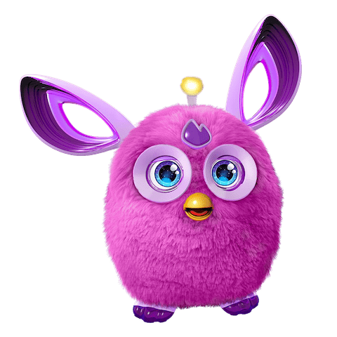

This is a test article for my site. It's so that I can make sure that things are being correctly read using GraphQL and that *.md files are being correctly parsed. I'll write more here when I'm actually testing article pages but for now I should have enough!

Here's a code block so that I can test code:

```javascript
// In your gatsby-config.js
plugins: [
  {
    resolve: `gatsby-transformer-remark`,
    options: {
      plugins: [
        `gatsby-remark-prismjs`,
      ]
    }
  }
]
```

here's some more:

```jsx
class FlavorForm extends React.Component { // highlight-line
  constructor(props) {
    super(props);
    this.state = {value: 'coconut'};

    this.handleChange = this.handleChange.bind(this);
    this.handleSubmit = this.handleSubmit.bind(this);
  }

  handleChange(event) {
    // highlight-next-line
    this.setState({value: event.target.value});
  }

  // highlight-start
  handleSubmit(event) {
    alert('Your favorite flavor is: ' + this.state.value);
    event.preventDefault();
  }
  // highlight-end

  render() {
    return (
      { /* highlight-range{1,4-9,12} */ }
      <form onSubmit={this.handleSubmit}>
        <label>
          Pick your favorite flavor:
          <select value={this.state.value} onChange={this.handleChange}>
            <option value="grapefruit">Grapefruit</option>
            <option value="lime">Lime</option>
            <option value="coconut">Coconut</option>
            <option value="mango">Mango</option>
          </select>
        </label>
        <input type="submit" value="Submit" />
      </form>
    );
  }
}
```

```javascript{1,4-9}
// In your gatsby-config.js
plugins: [
  {
    resolve: `gatsby-transformer-remark`,
    options: {
      plugins: [
        `gatsby-remark-prismjs`,
      ]
    }
  }
]
```

here's an example of some inline css: `css§.someclass { background-color: red; }` <- it's highlighted which is awesome!

I'm going to drop an image in here and see what happens too...



Woo!

what if I use a background image that's huge...


let's test bullets and lists now:

1. this is a numbered list
2. with 2 bits.

this is another sentence...

- this is an unordered list
- with multiple points...
  - and sub points...
- yay.

okay, now for some quotes:

> this is a quotation.
>
> It is two lines long...
> I'm going to write loads of stuff here and hopefully it's going to appear correctly
>
> This is a big gap?